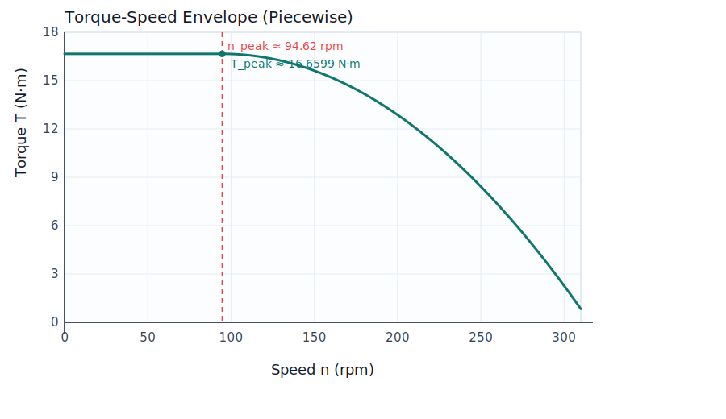

# 电机数据：

FL_calf:-0.0052~-1.4042(缩~申)				   FR_calf:0.0175~1.4368 (缩~申)

FL_thigh:-1.6601~1.0000(后~前)				 FR_thigh:1.7418~-0.8261 (后~前)

FL_hip:-0.5522~0.4007（上翻~下翻）			FR_hip:0.7582~-0.4049 （上翻~下翻）

RL_calf:-0.0136~-1.3881(缩~申)				   RR_calf:0.0117~1.4629(缩~申)

RL_thigh:-1.6938~0.0715 (后~前)				RR_thigh:1.7851~-0.0681(后~前)

RL_hip:0.8384~-0.4061（上翻~下翻）			RR_hip:-0.6692~0.4436（上翻~下翻）

方向（很多：可能是一半的电机）+零点（零点不符合的小腿）

# 当前拟合函数（Torque-Speed Envelope）

设转速为 \(n\)（rpm），先定义二次拟合函数：（为了保证不超过上限，c的数值从最接近的14.0886978降低为13.605312408）

\[
T_q(n)=a n^2 + b n + c
\]

其中参数为：

\[
a=-0.000341191,\quad b=0.064565966,\quad c=13.605312408
\]

峰值点：

\[
n_{\text{peak}}=-\frac{b}{2a}\approx 94.62\ \text{rpm}
\]

\[
T_{\text{peak}}=T_q(n_{\text{peak}})\approx 16.6599\ \text{N·m}
\]

## 分段包络函数

\[
T_{\text{env}}(n)=
\begin{cases}
T_{\text{peak}}, & n\le n_{\text{peak}}\\
T_q(n), & n>n_{\text{peak}}
\end{cases}
\]

### 函数图像（分段函数）

下图按分段函数绘制，坐标范围固定为：\(n\in[0,310]\) rpm，\(T\in[0,18]\) N·m。（）

实现时对正反转对称，使用 \(|n|\)。

## 物理裁剪后的可用扭矩上限

\[
T_{\max}(n)=\min\left(\max(T_{\text{env}}(|n|),\,0),\ \tau_{\text{sat}},\ \tau_{\text{limit}}\right)
\]

## 最终输出扭矩

\[
\tau_{\text{applied}}=\mathrm{clip}\!\left(\tau_{\text{cmd}},\ -T_{\max},\ T_{\max}\right)
\]

## 重力补偿数据及其拟合

#### 数据获取方式

在小腿电机水平放置的情况下，让小腿电机在之前的限位区间以很小的速度进行摆动360s转动2.8rad，即0.0078rad/s，近似视为每个旋转角度都处于平衡状态。接着在有弹簧的情况和拆卸弹簧的情况下各自测一组数据，最终每组数据大约20000行左右。

#### 数据处理方式：

- 先做有弹簧/无弹簧的角度插值差分
- 再筛选低速样本，条件是 ∣q˙∣<0.05 rad/s
- 再按角度分箱平均，bin 宽度是 0.02 rad
- 最后同时拟合了线性和三角函数

**线性拟合结果**

关节对应关系：

FR：2；

FL：5；

RR：8；

RL：11；

τ=kq+b*τ*=*k**q*+*b*

- 关节 2：

  τ=1.026204 q−1.966818,R2=0.9247

  关节 5：

  τ=1.270471 q+2.476247,R2=0.9568

  关节 8：

  τ=1.077613 q−2.153850,R2=0.9257
- 关节 11：

  τ=1.113021 q+2.225375,R2=0.9607

**三角拟合结果**

τ=asin⁡(q)+bcos⁡(q)+c

- 关节 2：

  τ=0.071473sin⁡(q)−1.504900cos⁡(q)−0.228728,R2=0.9492
- 关节 5：

  τ=0.464990sin⁡(q)+1.482100cos⁡(q)+0.814629,R2=0.9635
- 关节 8：

  τ=0.145519sin⁡(q)−1.499135cos⁡(q)−0.429548,R2=0.9462
- 关节 11：

  τ=0.442854sin⁡(q)+1.262931cos⁡(q)+0.814852,R2=0.9655
